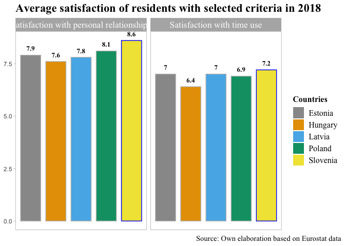

Eurostat data analysis with R
================

## Set up

Activate all packages (previously they could be installed with
install.packages(’’)).

``` r
library(eurostat)
library(rvest)
library(knitr)
library(dplyr)
library(ggrepel)
library(tidyverse)
library(ggplot2)
library(ggpubr)
library(RColorBrewer)
```

Prepare color blind palette.

``` r
cbPalette <- c("#999999", "#E69F00", "#56B4E9", "#009E73", "#F0E442")
```

## Research of potential countries to locate new EU research institute

This research was prepared as a project for university classes of Data
Visualization techniques

**Purpose**: To analyze the location for a new renewable energy sources
R&D Center

**Assumptions**:

- Institute should be located in the EU-13.

- In a country with a stable economic and political situation.

- In a country with high welfare for employees (also attractive to
  foreigners).

**Implementation**:

- Five countries were analyzed: Poland, Estonia, Hungary, Latvia and
  Slovenia.

- Based on the latest data from Eurostat and selected field statistics.

- The countries were analyzed in terms of four criteria, which were
  selected according to the assumptions.

- For each criterion, two statistics were analyzed.

- On the basis of all statistics, Slovenia was identified as the place
  to locate the new institute.

# I. Economic and political stability

## Gross Domestic Product per capita in PPS

GDP per capita is a measure of the size of the economy and economic
prosperity.

Purchasing power standard allows comparison of GDP of different
countries.

``` r
data_sat <- get_eurostat('sdg_10_10', type = "label", time_format = "num")
gdp <- subset(data_sat, geo  %in% c("Latvia", "Poland", "Estonia", "Hungary", 'Slovenia'))

gdp$na_item <- as.factor(gdp$na_item)
gdp$geo <- as.factor(gdp$geo)
unique(gdp$na_item)
```

    ## [1] Real expenditure per capita (in PPS_EU27_2020)                      
    ## [2] Volume indices of real expenditure per capita (in PPS_EU27_2020=100)
    ## 2 Levels: Real expenditure per capita (in PPS_EU27_2020) ...

``` r
gdp  <- gdp  %>% filter(na_item=='Real expenditure per capita (in PPS_EU27_2020)')

gdp %>%
  ggplot(aes(x=time, y=values, color=geo))+
  geom_line(size=1)+scale_color_manual(values =cbPalette )+
  labs(title = "Gross domestic product per capita in years 2000 - 2020", 
       subtitle = 'in purchasing power standard (PPS)',
       y="GDP per capita",
       caption = "Source: Own elaboration based on Eurostat data",
       color='Countries')+ theme_light()+
        theme(plot.caption.position = "plot",
        plot.caption = element_text(hjust = 1, family='Times New Roman', size=11),
        plot.title =element_text(face = "bold", family='Times New Roman', size=18),
        legend.title=element_text(family='Times New Roman', face = "bold", size=12),
        plot.subtitle = element_text( family='Times New Roman', size=16),
        legend.position = c(0.87, 0.25),
        legend.text=element_text(family='Times New Roman', size=12),
        panel.grid.major = element_blank(), 
        panel.grid.minor = element_blank(),
        axis.title.x=element_blank(),
        axis.title.y= element_text(family='Times New Roman'))
```

<!-- -->

### Findings

- Upward trend in every surveyed country can be noticed.

- Slovenia and Estonia had the largest GDP per capita among the surveyed
  countries in 2020.

- Slovenia had the largest GDP per capita of the surveyed countries in
  2000 - 2020.

## General government fiscal balance

- The fiscal balance is the difference between a government’s revenues
  and its expenditures.

- A positive difference generates a surplus, and a negative difference
  generates a budget deficit.

``` r
colors <- c('#ed8276', '#5BC5D3')
deficit <- get_eurostat('tec00127', type = "label", time_format = "num")
deficit$time <- as.factor(deficit$time)

deficit1 <- subset(deficit, geo  %in% c('Slovenia'))
deficit1 <-  deficit1  %>% filter(unit =="Percentage of gross domestic product (GDP)")
deficit1 <- deficit1 %>% mutate(mycolor = ifelse(values>0, "type1", "type2"))
deficit1<- deficit1[order(deficit1$geo, deficit1$time),]


ggdotchart(deficit1, x = "time", y = "values", color='mycolor', 
           sorting = "none",                     
           add = "segments",                             
           add.params = list(color = "lightgray", size = 2), 
           dot.size = 8.5,                               
           label = round(deficit1$values,1),                        
           font.label = list(color = "white", size = 9, 
                             vjust = 0.5),              
           ggtheme = theme_light())+
          geom_hline(yintercept = 0, linetype = 2, color = "lightgray")+
          scale_color_manual(values=colors)+
          labs(title="Slovenia's budget balance 2013-2020", 
          subtitle= 'expressed in % of GDP', 
          caption='Source: Own elaboration based on Eurostat data')+
          ylab('Deficit / Surplus % of GDP')+
  theme(legend.position = "none",
        axis.title.x=element_blank(),panel.grid.major = element_blank(), 
        panel.grid.minor = element_blank(), 
        plot.title =element_text(face = "bold", family='Times New Roman', size=16),
        plot.caption = element_text(hjust = 1, family='Times New Roman', size=11),
        axis.title.y= element_text(family='Times New Roman', size=12),
        plot.subtitle = element_text(family='Times New Roman', size=14))
```

<!-- -->

### Findings

- Slovenia recorded a budget surplus in 2017-2018.

- In 2020, all countries recorded a deficit, which may have been
  affected by the pandemic.

``` r
deficit1 <- subset(deficit, geo  %in% c('Latvia', 'Poland'))
deficit1 <-  deficit1  %>% filter(unit =="Percentage of gross domestic product (GDP)")
deficit1 <- deficit1 %>% mutate(mycolor = ifelse(values>0, "type1", "type2"))
deficit1<- deficit1[order(deficit1$geo, deficit1$time),]


ggdotchart(deficit1, x = "time", y = "values", color='mycolor', 
           sorting = "none",        
           add = "segments",                             
           add.params = list(color = "lightgray", size = 2), 
           dot.size = 7.6,                                
           label = round(deficit1$values,1),                       
           font.label = list(color = "white", size = 9, 
                             vjust = 0.5),              
           ggtheme = theme_light())+ geom_hline(yintercept = 0, linetype = 2, color = "lightgray")+
  facet_wrap(~geo, ncol=1)+
  scale_color_manual(values=colors)+
  labs(title="Latvian and Polish budget balance 2013-2020", 
       subtitle= 'expressed in % of GDP ', 
       caption='Source: Own elaboration based on Eurostat data')+
  ylab('Deficit / Surplus % of GDP')+
  theme(legend.position = "none",
        axis.title.x=element_blank(),panel.grid.major = element_blank(), 
        panel.grid.minor = element_blank(), 
        plot.title =element_text(face = "bold", family='Times New Roman', size=16),
        plot.caption = element_text(hjust = 1, family='Times New Roman', size=11),
        axis.title.y= element_text(family='Times New Roman', size=12),
        plot.subtitle = element_text(family='Times New Roman', size=14))
```

<!-- -->

### Findings

- The state of Latvia’s budget was characterized by rapid growth in
  2011-2012.

- Poland’s budget grew gradually in 2010-2018.

- In 2020, both countries experienced larger budget deficits than
  before.

- Latvia had the smallest deficit in 2020 among the selected countries.

``` r
deficit1 <- subset(deficit, geo  %in% c('Hungary', 'Estonia'))
deficit1 <-  deficit1  %>% filter(unit =="Percentage of gross domestic product (GDP)")
deficit1 <- deficit1 %>% mutate(mycolor = ifelse(values>0, "type1", "type2"))
deficit1<- deficit1[order(deficit1$geo, deficit1$time),]


ggdotchart(deficit1, x = "time", y = "values", color='mycolor', 
           sorting = "none",        
           add = "segments",                             
           add.params = list(color = "lightgray", size = 2), 
           dot.size = 7.6,                                
           label = round(deficit1$values,1),                       
           font.label = list(color = "white", size = 9, 
                             vjust = 0.5),              
           ggtheme = theme_light())+ geom_hline(yintercept = 0, 
                                                linetype = 2, 
                                                color= "lightgray")+
  facet_wrap(~geo, ncol=1)+
  scale_color_manual(values=colors)+
  labs(title="Estonian and Hungarian budget balance from 2013 to 2020", 
       subtitle= 'expressed in % of GDP ', 
       caption='Source: Own elaboration based on Eurostat data')+
  ylab('Deficit / Surplus % of GDP')+
  theme(legend.position = "none",
        axis.title.x=element_blank(),panel.grid.major = element_blank(), 
        panel.grid.minor = element_blank(), 
        plot.title =element_text(face = "bold", family='Times New Roman', size=16),
        plot.caption = element_text(hjust = 1, family='Times New Roman', size=11),
        axis.title.y= element_text(family='Times New Roman', size=12),
        plot.subtitle = element_text(family='Times New Roman', size=14))
```

<!-- -->

### Findings

- Hungary recorded the largest deficit in 2020 among the selected
  countries.

- Estonia had budget surplus more often then Hungary in 2013-2020.

# II. Human capital

## Percentage of GDP invested in R&D in 2020

Investment in R&D enhances the country’s innovation and scientific
potential and boosts economic development.

``` r
#dev.off()

europ_map <- map_data("world", region = c("Austria","Belgium","Bulgaria","Croatia","Cyprus",
                                            "Czech Rep.","Denmark","Estonia","Finland","France",
                                            "Germany","Greece","Hungary","Ireland","Italy","Latvia",
                                            "Lithuania","Luxembourg","Malta","Netherlands","Poland",
                                            "Portugal","Romania","Slovakia","Slovenia","Spain",
                                            "Sweden","United Kingdom"))


lebel_map <- map_data("world", region = c("Latvia", "Poland", "Estonia", "Hungary", 'Slovenia'))
region.lab.data <- lebel_map %>%
  group_by(region) %>%
  summarise(long = mean(long), lat = mean(lat))


rd_to_merge <- get_eurostat('tsc00001', type = "label", time_format = "num")
rd_to_merge <- subset(rd_to_merge, geo  %in% c("Latvia", "Poland", "Estonia", "Hungary", 'Slovenia'))
rd_to_merge <-  rd_to_merge  %>% filter(sectperf=='All sectors', time==2020)


df_europe <- merge(x=europ_map, y=rd_to_merge, by.x = 'region', by.y ='geo', all.x=TRUE)
df_europe <- df_europe[order(df_europe$group, df_europe$order),]


ggplot(data=df_europe, aes(x=long, y=lat)) +
   geom_polygon(colour = "grey", aes(group= group, fill = values))+
  geom_text(aes(label = region), data = region.lab.data,  family='Times New Roman',size = 5, hjust = c(0.01, 0.2,0.01,0.01,0.01), vjust=c(1.5,1,1.5,0.01,2))+
            coord_map("stereographic")+scale_fill_gradient(low="#e0ecf4",high="#8856a7", na.value="lightgrey")+
  theme_minimal()+
  labs(title="Percentage of GDP invested in R&D in 2020", 
       caption='Source: Own elaboration based on Eurostat data', fill = "")+
  theme(axis.text.x=element_blank(),
        axis.text.y=element_blank(),
        axis.ticks=element_blank(),
        axis.title.x=element_blank(),
        axis.title.y=element_blank(),
        plot.caption = element_text(hjust = 1, family='Times New Roman', size=12),
        plot.title =element_text(face = "bold", family='Times New Roman', size=18),
        panel.grid.major = element_blank(), 
        panel.grid.minor = element_blank())
```

<!-- -->

### Findings

- Slovenia invested the most among the surveyed countries in R&D.

- Latvia invested the least in R&D compared to the other countries
  surveyed.

## Percentage of residents with tertiary education and/or employed in science and technology

This statistic shows the potential of the country’s human capital under
study.

``` r
human <- get_eurostat('tsc00025', type = "label", time_format = "num")
human <- subset(human, geo  %in% c("Latvia", "Poland", "Estonia", "Hungary", 'Slovenia'))
human <-  human  %>% filter(sex %in% c("Females", "Males"), time==2020)
human <- arrange(human, geo, values)


palette <- c("#E7B5D3", "#B5D4E7")
ggplot(data=human, aes(x=reorder(geo, -values), y=values, fill=sex)) +
  geom_bar(stat="identity", color="black", position=position_dodge(), width = 0.7)+
  theme_light()+
  scale_fill_manual(values=palette)+
  geom_text(aes(label = values),size = 3, vjust = -1,
            colour = "black", position = position_dodge(0.7), fontface='bold')+
  labs(title="Individuals with higher education and/or employed in science and technology", 
       subtitle='by gender structure in 2020',
       caption='Source: Own elaboration based on Eurostat data', fill='Płeć')+ 
        ylab("Percentage of population in the country's labor force")+
  theme(legend.position = 'bottom',
        legend.title = element_blank(),
        panel.grid.major = element_blank(), 
        panel.grid.minor = element_blank(),
        panel.background = element_blank(),
        axis.title.x=element_blank(),
        legend.text=element_text(family='Times New Roman', size=12),
        plot.title =element_text(face = "bold", family='Times New Roman', size=16),
        plot.caption = element_text(hjust = 1, family='Times New Roman', size=12),  
        plot.subtitle = element_text( family='Times New Roman', size=16, face='bold'),
        axis.title.y= element_text(family='Times New Roman'))
```

<!-- -->

### Findings

- Estonia and Slovenia have the highest number of university graduates
  or workers in the sciences (as a percentage of the entire country’s
  workforce) regardless of gender.

- In all selected countries, the ratio is higher for women than for men.

# III.Labor market

## Percentage of remote workers aged 25-63 in 2019

Numerous studies show that the ability to work remotely has a positive
impact on employee well-being

``` r
wfh <- get_eurostat('lfst_hhwahchi', type = "label", time_format = "num")
wfh <- subset(wfh, geo  %in% c("Latvia", "Poland", "Estonia", "Hungary", 'Slovenia'))


wfh <-  wfh  %>% filter(n_child =="Total", sex=='Total', agechild=='Total', age=='From 25 to 54 years', time=='2019')
wfh_map <- merge(x=europ_map, y=wfh, by.x = 'region', by.y ='geo', all.x=TRUE)
wfh_map <- wfh_map[order(wfh_map$group, wfh_map$order),]


ggplot(data=wfh_map, aes(x=long, y=lat)) +
  geom_polygon(colour = "grey", aes(group= group, fill = values))+
  geom_text(aes(label = region), data = region.lab.data,  size = 4.5, family='Times New Roman', hjust = c(0.01, 0.2,0.01,0.01,0.01), vjust=c(1.5,1,1.5,0.01,2))+
  coord_map("stereographic")+scale_fill_gradient(low="#e5f5f9",high="#2ca25f", na.value="lightgrey")+
  theme_minimal()+
  labs(title="Percentage of remote workers aged 25-63 in 2019",
       caption='Source: Own elaboration based on Eurostat data', fill = "")+
  theme(axis.text.x=element_blank(),
        axis.text.y=element_blank(),
        axis.ticks=element_blank(),
        axis.title.x=element_blank(),
        axis.title.y=element_blank(),
        plot.caption = element_text(hjust = 1, family='Times New Roman', size=12),
        plot.title =element_text(face = "bold", family='Times New Roman', size=18),
        panel.grid.major = element_blank(), 
        panel.grid.minor = element_blank())
```

<!-- -->

### Findings

- Estonia has the highest percentage of employees doing their work
  remotely among the countries surveyed.

## Percentage of people participating in education and training

Training and development are important elements of the modern world.
Research workers appreciate the opportunity to improve their skills.

``` r
hours <- get_eurostat('trng_lfse_01', type = "label", time_format = "num")
hours <- subset(hours, geo  %in% c("Latvia", "Poland", "Estonia", "Hungary", 'Slovenia'))
hours <-  hours  %>% filter(sex %in% c('Total'),time==2020, 
                            age %in% c('From 25 to 34 years', 'From 35 to 44 years', 
                                      'From 45 to 54 years','From 55 to 64 years'))
hours$age <- as.factor(hours$age)

levels(hours$age)[levels(hours$age)=='From 25 to 34 years'] <- '25-35 years'
levels(hours$age)[levels(hours$age)=='From 35 to 44 years'] <- '25-44 years'
levels(hours$age)[levels(hours$age)=='From 45 to 54 years'] <- '45-54 years'
levels(hours$age)[levels(hours$age)=='From 55 to 64 years'] <- "55-64 years"
ggplot(data=hours, aes(x=reorder(geo, -values), y=values, fill=age)) +
  geom_bar(stat = "identity", width = 0.7, position = "dodge")+
  scale_fill_brewer(palette = 'Set3')+
  geom_text(aes(label = values),size = 3.5, vjust = -1,
            colour = 'black', position = position_dodge(0.7)) +
  labs(title = "Percentage of employees in age groups participating in education", x="Kraje", 
       y='Percentage of age group',
       subtitle = 'and training in 2020', 
       caption = "Source: Own elaboration based on Eurostat data",
       fill='Age group')+ theme_light()+
  theme(plot.caption.position = "plot",
        plot.caption = element_text(hjust = 1, family='Times New Roman', 
                                    size=12),
        plot.title =element_text(face = "bold", family='Times New Roman', size=16),
        plot.subtitle = element_text(face = "bold", family='Times New Roman', size=16),
        panel.grid.major = element_blank(), 
        panel.grid.minor = element_blank(),
        axis.title.x=element_blank(),
        legend.position = c(0.85, 0.87),
        strip.text = element_text(size=14, family='Times New Roman'),
        legend.title=element_text(family='Times New Roman', face = "bold", size=12),
        axis.title.y= element_text(family='Times New Roman', size=12))
```

<!-- -->

### Findings

- Among the countries surveyed, Estonia had the highest number (by
  percentage) of people in each age group participating in all types of
  education and training in 2020.

# IV. General welfare of the country

## Healthy life years in absolute value at birth from 2004 to 2019

- The expected average number of years a person is expected to live
  without disability at birth.

- Life expectancy is indicative not only of access to and quality of
  medical services, but also of people’s well-being, social, economic
  conditions and national development

``` r
life <- get_eurostat('hlth_hlye', type = "label", time_format = "num")
life <- subset(life, geo  %in% c("Latvia", "Poland", "Estonia", "Hungary", 'Slovenia'))

life <-  life  %>% filter(sex =="Total", indic_he=='Healthy life years in absolute value at birth', 
                          time %in% c(2019, 2018, 2017, 2016, 2015, 2014, 2013,
                                      2012, 2011, 2010, 2009, 2008, 2007, 2006, 2005))


fisrt <- life%>%group_by(geo) %>% slice(which.min(time))
f <- data.frame(fisrt)
max <- life%>%group_by(geo) %>% slice(which.max(time))
m <- data.frame(max)
both <- rbind(f, m)


life %>%
  ggplot(aes(x=time, y=values, color=geo))+
  geom_line(size=1)+scale_color_manual(values =cbPalette )+
  scale_x_continuous(breaks=c(2005, 2007, 2009, 2011, 2013,2015, 2017, 2019))+
  geom_label(data=both, aes(label=values, x=time), show.legend = FALSE)+
  labs(title = "Healthy life years in absolute value at birth ",subtitle = 'in 2004-2019', x="Years", 
       y="Healthy life expectancy",
       caption = "Source: Own elaboration based on Eurostat data",
       color='Countries')+ 
  theme_light()+
  theme(plot.caption = element_text(hjust = 1, family='Times New Roman', size=11),
        plot.title =element_text(face = "bold", family='Times New Roman', size=16),
        legend.title=element_text(family='Times New Roman', face = "bold", size=12),
        plot.subtitle = element_text( family='Times New Roman', size=14),
        legend.text=element_text(family='Times New Roman', size=12),
        panel.grid.major = element_blank(), 
        panel.grid.minor = element_blank(),
        axis.title.x=element_blank(),
        axis.title.y= element_text(family='Times New Roman', size=12))
```

<!-- -->

### Findings

- Healthy life expectancy was highest for Poland in the years studied,
  and although it has an upward trend, life expectancy in 2005 was
  higher compared to 2019.

## Healthy life years in absolute value at birth in 2004-2019 by age structure

``` r
life <- get_eurostat('hlth_hlye', type = "label", time_format = "num")
life <- subset(life, geo  %in% c("Latvia", "Poland", "Estonia", "Hungary", 'Slovenia'))

life <-  life  %>% filter(sex %in% c('Males', 'Females'), indic_he=='Healthy life years in absolute value at birth', 
                          time==2019)


palette <- c("#E7B5D3", "#B5D4E7")
ggplot(data=life, aes(x=reorder(geo, -values), y=values, fill=sex)) +
  geom_bar(stat="identity", color="black", position=position_dodge(), width = 0.6)+
  theme_light()+
  scale_fill_manual(values=palette)+
  geom_text(aes(label = values),size = 3, vjust = -1,
            colour = "black", position = position_dodge(0.6), fontface='bold')+
  labs(title="Healthy life expectancy in 2020 by gender structurei", 
       caption='Source: Own elaboration based on Eurostat data', fill='Płeć')+ 
  ylab("Years of healthy living")+
  theme(legend.position = 'bottom',
        legend.title = element_blank(),
        panel.grid.major = element_blank(), 
        panel.grid.minor = element_blank(),
        panel.background = element_blank(),
        axis.title.x=element_blank(),
        legend.text=element_text(family='Times New Roman', size=12),
        plot.title =element_text(face = "bold", family='Times New Roman', size=16),
        plot.caption = element_text(hjust = 1, family='Times New Roman', size=12),  
        plot.subtitle = element_text( family='Times New Roman', size=16, face='bold'),
        axis.title.y= element_text(family='Times New Roman'))
```

<!-- -->

### Findings

- Latvia recorded the lowest rate in 2019.

- Every country has higher healthy life expectancy at birth for women
  than for men in 2019, which is in line with the global trend.

- Although, Poland and Estonia have the largest gap between healthy life
  expectancy at birth for women and men.

## Average resident satisfaction with selected criteria in 2018.

This statistic is an average rating (from 1 to 10) of residents’
satisfaction with selected aspects of life.

``` r
data_sat <- get_eurostat('ilc_pw01', type = "label", time_format = "num")
sat <- subset(data_sat, geo  %in% c("Latvia", "Poland", "Estonia", "Hungary", 'Slovenia'))


df1  <- sat  %>% filter(sex == 'Total', age =='16 years or over', time==2018, isced11=='All ISCED 2011 levels',
                       indic_wb %in% c('Satisfaction with financial situation', 
                                       "Job satisfaction", 'Overall life satisfaction'))


#find the max value in group 
df1 <- df1%>% group_by(indic_wb) %>% mutate(ismax=as.integer(values==max(values)))
df1$ismax <- as.character(df1$ismax)


ggplot(data = df1, aes(x = geo, y = values, fill=geo, color = ismax)) +
  geom_bar(stat = "identity", position = "dodge", width = 0.8) +
  facet_wrap(~indic_wb)+
  labs(title = "Average satisfaction of residents with selected criteria in 2018", 
       caption = 'Source: Own elaboration based on Eurostat data')+
  geom_text(aes(label = values),size = 3.5, vjust = -1, family='Times New Roman',
            colour = 'black', position = position_dodge(0.9), 
            fontface='bold') +
  theme_light()+
  scale_color_manual(values = c('1'="blue",'0'='grey'), guide='none')+
  scale_fill_manual(values=cbPalette)+
  labs(fill = 'Countries')+
  theme(plot.caption.position = "plot",
        legend.text=element_text(family='Times New Roman', size=12),
        legend.title=element_text(family='Times New Roman', face = "bold", size=12),
        plot.caption = element_text(hjust = 1, family='Times New Roman', size=11), 
        plot.title =element_text(face = "bold", family='Times New Roman', size=17),
        axis.title.x=element_blank(),
        axis.title.y=element_blank(),
        axis.text.x=element_blank(),
        axis.ticks.x=element_blank(),
        strip.text = element_text(size=13, family='Times New Roman'),
        panel.grid.major = element_blank(), 
        panel.grid.minor = element_blank())
```

<!-- -->

### Findings

- Estonian residents are the most satisfied with their jobs compared to
  other countries surveyed.

- Residents of Poland rated overall satisfaction with life highest
  compared to other countries surveyed.

- Poles and Slovenes are happy with their financial situation on average
  more than residents of the other countries surveyed.

``` r
df2  <- sat  %>% filter(sex == 'Total', age =='16 years or over', time==2018, isced11=='All ISCED 2011 levels',
                       indic_wb %in% c('Satisfaction with personal relationships', 'Satisfaction with time use'))

#find the max value in group 
df2 <- df2 %>% group_by(indic_wb) %>% mutate(ismax=as.integer(values==max(values)))
df2$ismax <- as.character(df2$ismax)


ggplot(data = df2, aes(x = geo, y = values, fill=geo, color = ismax)) +
  geom_bar(stat = "identity", position = "dodge", width = 0.8) +
  facet_wrap(~indic_wb)+
  labs(title = "Average satisfaction of residents with selected criteria in 2018", 
       caption = 'Source: Own elaboration based on Eurostat data')+
  geom_text(aes(label = values),size = 3.5, vjust = -1, family='Times New Roman',
            colour = 'black', position = position_dodge(0.9), 
            fontface='bold') +
  theme_light()+
  scale_color_manual(values = c('1'="blue",'0'='grey'), guide='none')+
  scale_fill_manual(values=cbPalette)+
  labs(fill = 'Countries')+
  theme(plot.caption.position = "plot",
        legend.text=element_text(family='Times New Roman', size=12),
        legend.title=element_text(family='Times New Roman', face = "bold", size=12),
        plot.caption = element_text(hjust = 1, family='Times New Roman', size=11), 
        plot.title =element_text(face = "bold", family='Times New Roman', size=17),
        axis.title.x=element_blank(),
        axis.title.y=element_blank(),
        axis.text.x=element_blank(),
        axis.ticks.x=element_blank(),
        strip.text = element_text(size=13, family='Times New Roman'),
        panel.grid.major = element_blank(), 
        panel.grid.minor = element_blank())
```

<!-- -->

### Findings

- On average, Slovenian residents rated both satisfaction with personal
  relationships and use of time higher than residents of other countries
  surveyed.

- On average, Slovenian residents are more satisfied with the aspects
  presented.

### Bibliography

<https://ec.europa.eu/eurostat/web/main/data/database>
